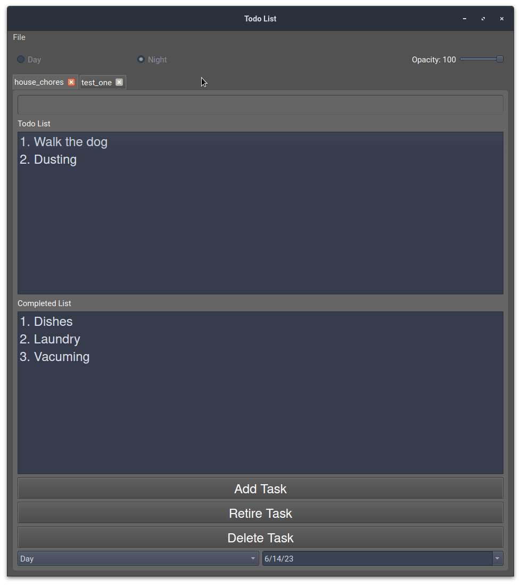

************
todo_six
************

This repository contains a todo list implimented with a Graphical User Interface (GUI).  The
code based was programmed in the Python programming language using the PyQt6 library, hend
the six in todo_six.

.. image:: https://img.shields.io/badge/code%20style-black-000000.svg
    :target: https://github.com/psf/black

.. image:: https://img.shields.io/badge/%20imports-isort-%231674b1?style=flat&labelColor=ef8336
    :target: https://pycqa.github.io/isort/

.. image:: https://readthedocs.org/projects/flake8/badge/?version=latest
    :target: https://flake8.pycqa.org/en/latest/?badge=latest
    :alt: Documentation Status

.. image:: http://www.mypy-lang.org/static/mypy_badge.svg
   :target: http://mypy-lang.org/

Contributing
############
Pull requests are welcome.  For major changes, please open an issue first to discuss
what you would like to change.  Please make sure to include and update tests
as well as relevant doc-string and sphinx updates.

License
#######
This softwate package is written under an MIT License

Requirements
############
Code requirements are described in the poetry.lock and pyproject.toml files

Installation
############
In order to download this repository from github, follow these instructions

#. Install poetry globally on your computer. Follow the instructions from `Poetry <https://python-poetry.org/docs/>`_
#. Set the poetry virtual environment with the following command ``poetry config virtualenvs.in-project true``
#. Ensure you have .git installed on your computer.
#. At your desired location create a directory titled ``todo_six``
#. Open a terminal (Bash, zsh or DOS) and cd to the ``todo_six`` directory
#. Type ``git clone https://github.com/Jon-Webb-79/todo_six.git todo_six``
#. Install packages with ``poetry install``

To install the package as an executable complete the developer installation process,
and complete the following steps.

For Linux and Macintosh Users

#. Navigate to the correct installation directory.
   #. For zshell navigate to ``cd scripts/zsh``
   #. For bash navigate to ``cd scripts/bash``
#. Run the installation script.
   #. For zshell ``zsh install.zsh``
   #. For bash ``bash install.sh``
#. The script will run and create another directory at the root directory for the repository
   titled ``dist``.  A copy of the executable will be stored in the ``dist`` directory.
   If you are running Mac OS, the executable will be titled ``todo.app``, if you are running
   linux the directory will be titled ``todo``.
#. Despite the fact that the executable is stored in the ``dist`` directory, a copy is installed
   in ``~/bin`` if you are running Linux or ``~/Applications`` if you are running Mac OS.
   Furthermore, if you are running a Linux distribution, a ``todo.desktop`` file is copied
   to your ``~/.local/share/applications/`` directory.  At this point, the executable
   should be visible in teh application menu if running Linux, or LaunchPad if using Mac.
#. If the application is not visible in LaunchPad for Mac users, then type ``killall Dock``
   into the termal to restart the dock.

For PC Users (**NOTE:** This process is not tested yet for PC users)

#. Navigate to ``cd scripts/DOS``
#. Run ``install.cmd``
#. The script will run and create another directory at the root of the directory for the
   repository titled ``dist``.  A copy of the executable will be stored in ``dist``.
#. Despite hte fact that hte executable is stored in ``dist``, a copy is installed in
   ``~\Program Files\ ``.
#. The executable should be visible in your list of applications

User Instructions
#################
todo_six is a Todo list application within in the Python3 language using the PyQt6 library, hence
the name todo_six.  This application allows a user to manager multiple todo lists ina  single application,
and also allows the user to view not only view their recently completed tasks, but any tasks completed
within specific time frames.  Furthremore, the user can also review their todo tasks and completed
tasks on any date they wish.  Most important, unlike other applications that store data on the cloud,
this application stores all data locally in SQLite databases, which protects their privacy.

Login Screen
************
When a user opens the todo_six application, it loads a landing page that has basic functionality.
As you can see from the Figure below, the login screen contains a radio button that allows the use
to choose a day theme or a night theme.  In addition, the user can control the opacity of
the application with a slider.

.. image:: docs/sphinx/source/images/login_screen.png
   :align: center

Create and Open a List
**********************
On Windows and Linux machines, the menu bar will appear attached to the top of
an application.  However, on Macintosh platforms it will appear at the top
of the screen, detached from the application.

A user can create a new list by clicking ``File > New``.  This will open up a
window that prompts the user to navigate the the directory where they want
to createa a todo database.  The user can then enter the name of the database,
click Save, and the empty todo list will be saved to the user defined directory.

.. image:: docs/sphinx/source/images/create_file.png
   :align: center

Once the database has been created, the screen will be populated with a tab containing
all buttons that allow a user to enter a task into the entry field, and then
to the todo list and completed list.

THe user can also open an existing database via ``File > Open``.  The application will
allow a user to create and open multiple tabs at any one time.  Each tab will be
associated with a new database.

Close the Application
*********************
A user can close the application in one of several ways.  The user can click on the ``X`` icon on the right side
of the tab, which will safely close the database associated with that task list and then close the tab.
The user can also Navigate to ``File > Close`` which will safely close all databases, and then close
each tab.  Finally, the user can click the ``X`` icon at the top right of the application, which will
safely close each database, all tabs, and then exit the application.

Push Buttons
************
The user can create a todo task by typing it into the entry field at the top of the
application.  To add the task to the todo list, the user can press the **Add Task**
button, or they can use the **enter** key as a shortcut for the button.

To move a task from the Todo list to the Completed list, a user must highlight the
task to be moved and then press the **Retire Task** button.  The user can also
press the **del** key as a shortcut to the **Retire Task** button.  This does
not delete a task, but instead marks it as complete.

Finally a user can delete a task from the database by highlighting it and pressing
the **Delete Task** button, or **Shit del** as a shortcut key.  THe application
will ask the user if they are sure they want to delete the task before carrying
out the operation.  In addition, a user can delete a task from the todo and completed
task lists.

Calendar Options
****************
When a database todo list is launched, the date in the bottom right hand corner
of the application should be the current date, and teh bottom left hand option should
be **Day**.  If the user toggles the lower left hand time frame option to another value,
which could be **Week**, **Month**, '**Year**, or **All**, the application will show
all tasks that were completed within the previous work week of the listed date, the
previous month, going back to the first of the month, the previous year, going back to
the first of the year, or all tasks that have been completed.

The user can also select the date on the bottom right hand of the screen.  This
will produce a calendar widget that will allow a user to select any date ranging
from the earliest date a task was entered to the current date.  If the user selects
a date that is different than the current date, all buttons and entry fields will
be de-activated, as the user can only view past tasks, but can not change them.
The use of this feature will show a user all tasks that were in work and completed
within the drop down menu time frame of the selected date.
